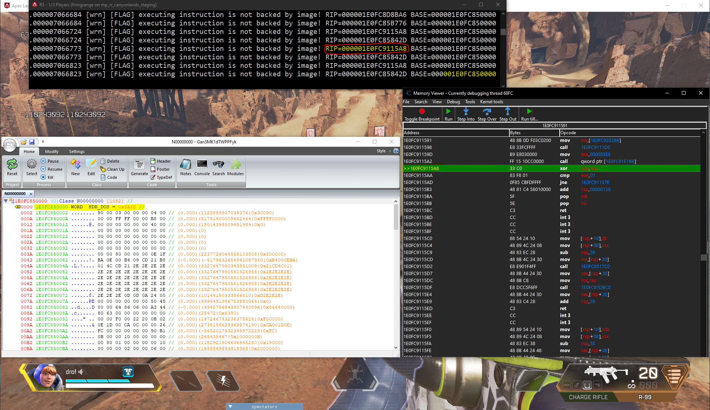

# dac-um
This is the usermode component of my project DemoAntiCheat. 
I am planning to document existing methods of in-process cheat detection, and maybe add some new (experimental) features later on. 

Currently implemented features are: 
 - Stack Trace (checks for shellcode execution from manually allocated memory)
 
# Usage
Simply build using visual studio 2019, and inject `dac-um.dll` into the target process. Only 64-Bit processes are supported! 
On success, you should see a console window similar to the one below. All relevant information will be printed on that console window:

